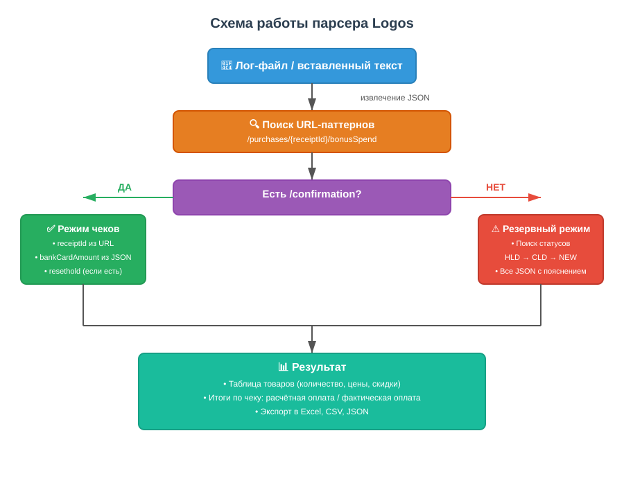

## Проблематика

После обновлений в приложении иногда неправильно считалась итоговая стоимость корзины. Разобраться в причинах мешало:

- логи содержали **сотни вложенных JSON** — вручную их не просмотреть
- **receiptId** (идентификатор чека) и **сумма оплаты** лежали в разных местах
- на один чек могло быть несколько ответов с разными статусами (`HLD`, `CLD`, `NEW`)

В итоге на поиск одного дефекта уходили часы.

## Инструменты

- **Python 3** — написали утилиту с оконным интерфейсом
- **Регулярные выражения** — вычленяют URL-паттерны и идентификаторы
- **Tkinter** — таблицы и вкладки, чтобы не работать в консоли

## Решение

Сделали **парсер логов**, который сам находит все чеки, достаёт товары, скидки и реальную сумму оплаты — и показывает в удобной таблице.

- Сам ищет URL `/purchases/{receiptId}/bonusSpend` и `/confirmation`
- Сравнивает расчётную оплату с фактической (`bankCardAmount`)
- Если структуры нет — переключается в резервный режим и ищет по статусам `HLD` → `CLD` → `NEW`

## Демо

Покажем на двух примерах:

- Загружаем лог мобильного приложения — видим список чеков, таблицу товаров и итоги.
- Открываем десктопный лог — парсер находит чеки даже без стандартных URL, через резервный поиск по статусам.

<video src="demo-01.mp4" controls playsinline preload="metadata"></video>

<video src="demo-02.mp4" controls playsinline preload="metadata"></video>

## Вопросы?

- Что делать, если в логе вообще нет JSON с товарами?
- Парсер умеет искать чеки, если URL записаны не в стандартном виде?
- Можно ли сохранить результаты, чтобы показать разработчикам?