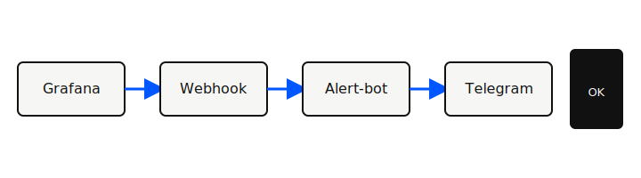

## Проблема

В проде приходили **десятки однотипных алертов** в чат: дежурный тратил время на фильтрацию, а не на исправление.

- Нет единого формата сообщения
- Дубли при каскадных сбоях
- Сложно понять «что делать дальше»

## Инструменты

| Инструмент | Зачем |
|------------|-------|
| Python + aiogram | Telegram-бот |
| Grafana / Alertmanager | источник событий |
| Cursor | быстрые итерации кода |

## Решение

Собрали **Alert-bot**: нормализация payload, дедупликация по fingerprint, кнопки действий в сообщении.

```text
Grafana → webhook → bot → чат (1 сообщение = 1 инцидент)
```

Схема потока:



## Демо

Покажем: как выглядит **сырой алерт** и как бот сворачивает его в одно читаемое сообщение.

## Вопросы?

- Нужны ли эскалации по таймеру?
- Какие каналы кроме Telegram?
