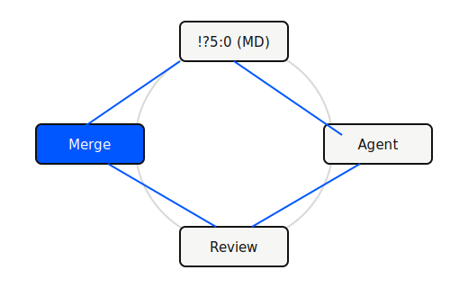

## Проблема

Задачи «на пару часов» растягивались: **контекст терялся** между чатами, ревью и ручным копипастом из документации.

## Инструменты

- **Cursor** — Agent, правила проекта, skills
- **Git** — ветки под эксперименты
- **MD-спеки** в репозитории — единый источник требований

## Решение

Зафиксировали **минимальный цикл**: спека в MD → агент по задаче → diff → ручная проверка критичных мест.

Правила в `.cursor/rules` снижают «угадывание» стиля кода.

## Демо

Сравним: запрос без контекста и запрос **со спекой + правилами** — разница в качестве diff.

## Вопросы?

Где проходит граница «доверяем агенту» vs «пишем сами»?
