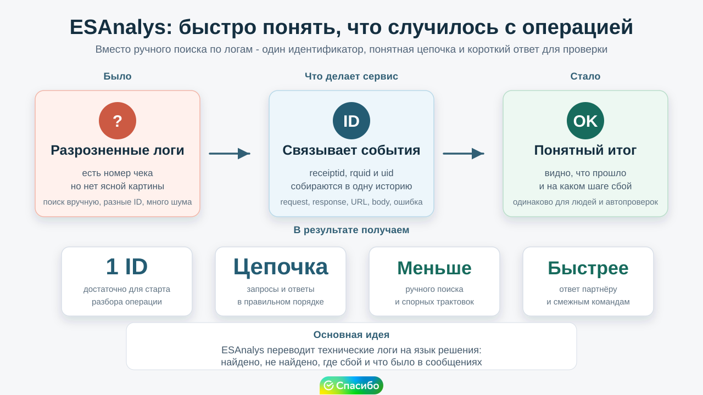
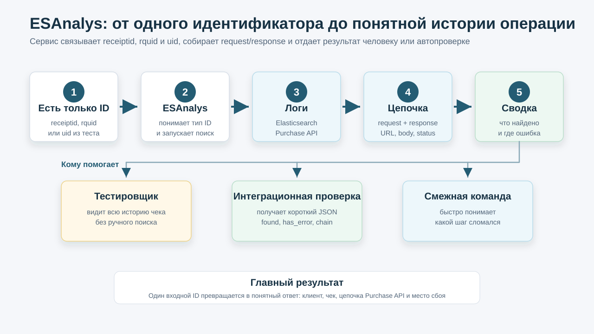
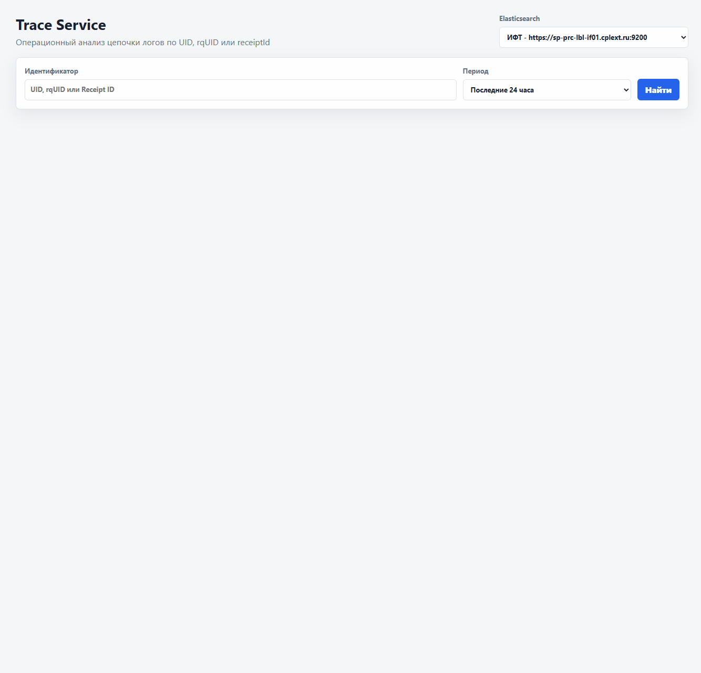
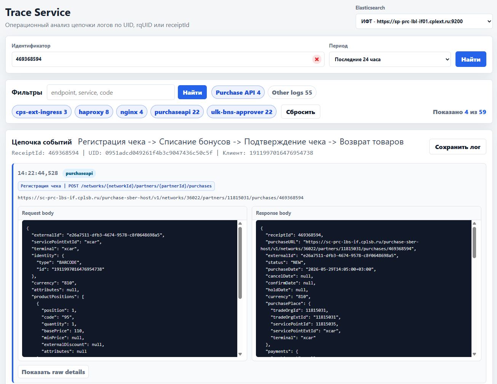
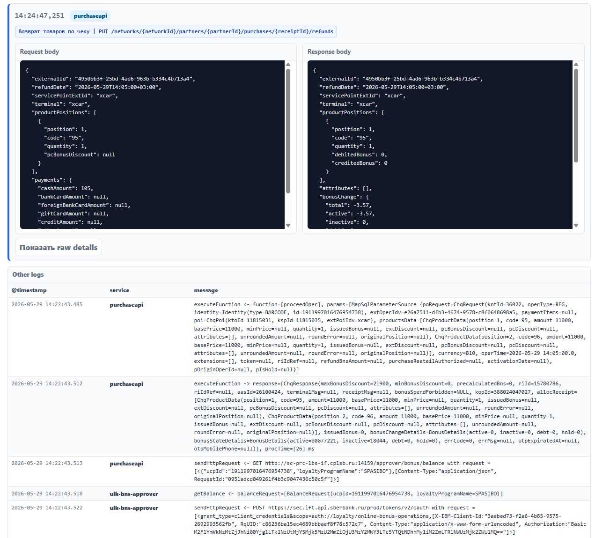

## Проблематика

Для разбора ситуаций, когда интеграционный тест падает или поступает общание от смежных команд, одного номера чека или request id часто недостаточно: нужно понять, какие запросы реально прошли, где был ответ и что лежало в теле сообщения, что вызвало ошибку. Раньше для этого приходилось собирать вручную по логам, а цепочка могла быть разбросана по разным сервисам и временным меткам.

- Один сценарий может иметь несколько связанных идентификаторов: `receiptid`, `rquid`, `uid`
- Запрос и ответ не всегда лежат рядом, а часть логов относится к вспомогательным сервисам
- Команде нужно быстро объяснить статус проверки: что произошло, где ошибка, какой клиент и чек участвовали

## Инструменты

- **Web-интерфейс ESAnalys** - поиск по одному идентификатору и просмотр цепочки Purchase API
- **Elasticsearch** - источник логов, где сервис ищет события по `receiptid`, `rquid` и `uid`
- **Внешнее API** - `POST /api/summary` для автопроверок и подключения сторонних сервисов(агентов)
- **Postman-коллекция** - быстрый ручной прогон контрактов без подготовки отдельного клиента

## Решение

ESAnalys превращает разрозненные логи в понятную историю операции: ввели любой известный идентификатор - получили цепочку запросов и ответов по чеку.

- Сервис сам находит связанные `uid`, `rquid`, `receiptid` и идентификатору клиента
- Для Purchase API собираются пары `Запрос/Ответ`, URL, статус и тело сообщений
- UI подходит для ручного разбора, а `/api/summary` возвращает короткий JSON для внешних проверок

## Демо

Покажем путь от одного идентификатора до понятной сводки.

- Вводим `receiptid` или `rquid` в интерфейсе и видим бизнес-цепочку по чеку
- Раскрываем request/response body и проверяем, какие данные ушли и что вернулось
- Отправляем `POST /api/summary` и получаем компактный ответ: найдено ли событие, какие идентификаторы связаны, сколько пар собрано
- Для интеграционного теста достаточно проверить `found`, `has_error`, `summary.chain` и нужные поля body

## Вопросы?

?
