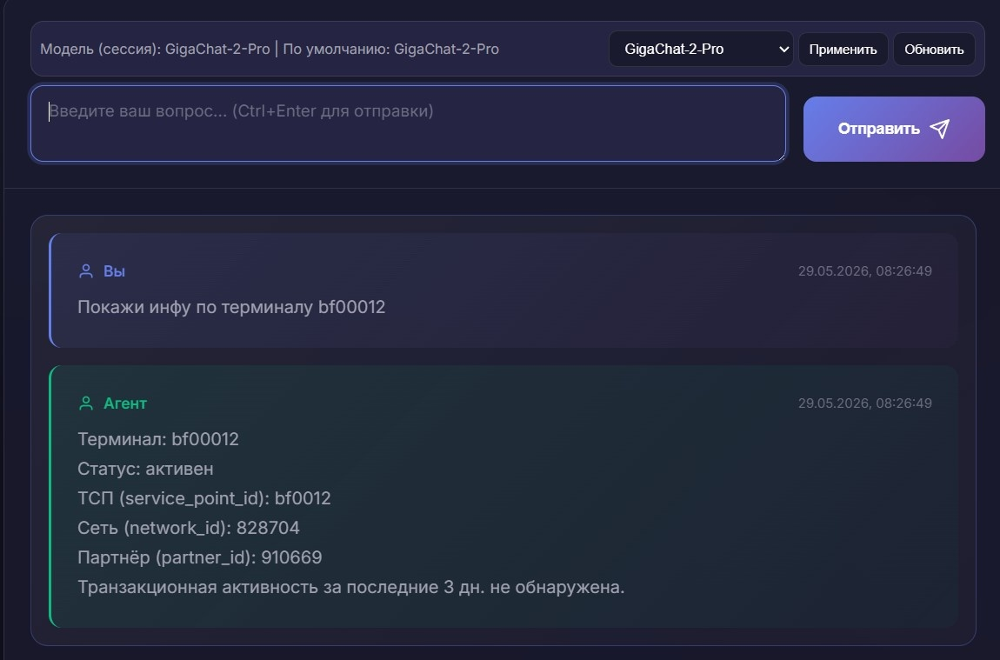
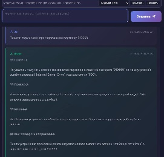

## Проблема

В поддержке и эксплуатации снова и снова спрашивают одно и то же: **что известно по этому терминалу**, **есть ли такой мерчант в базе**, **к какой точке обслуживания (ТСП) привязан объект**, **были ли операции за последние дни**.

- Раньше инженер сам открывал базу или ждал отчёт в другой системе — на простой ответ уходили **минуты**
- Один и тот же номер в логах называется по-разному — легко ошибиться и смотреть не то поле
- Обычный чат с нейросетью может ответить уверенно, но **без проверки по реальным данным** — ошибки всплывали уже у партнёра

## Инструменты

- **GOLEM** — умный помощник: принимает вопрос обычным текстом, из лога или из фрагмента JSON
- **База операционных данных** — справочник терминалов и таблица транзакций (только чтение, без изменений)
- **GigaChat** — понимает формулировку вопроса и собирает понятный ответ по фактам из базы
- **Корпоративный чат (Open WebUI)** — тот же помощник доступен там, где привыкли работать с чатами

## Решение

Теперь можно **спросить по-человечески** — система сама найдёт номер в сообщении, **проверит базу** и ответит сводкой. Если записи нет — так и скажет, не «придумает» активный терминал.

- Понимает терминал, мерчанта, ТСП, сеть, партнёра — в том числе если ID спрятан в логе
- Два типичных режима: **«есть ли в базе?»** и **«покажи обзор за последние дни»** (по умолчанию три дня)
- Ответ опирается только на то, что реально нашлось в данных — не на догадку модели

## Демо

Покажем в чате: пишем «Покажи информацию по терминалу 12345678» — через полминуты видим привязку к ТСП, статус и была ли активность за последние дни.

Затем — вставляем кусок лога с JSON: система сама вытащит номера и даст тот же вид проверки без ручного разбора полей.

## Вопросы?

- А если в справочнике терминала нет, но операции в базе есть — что покажет?
- Можно ли доверять ответу, если его пишет нейросеть, а не человек?
- Это заменяет SQL и отчёты для аналитиков?
- Почему иногда ответ приходит не сразу, а через десяток секунд?
- Кто настраивает, какие поля и период «последних дней» по умолчанию?
