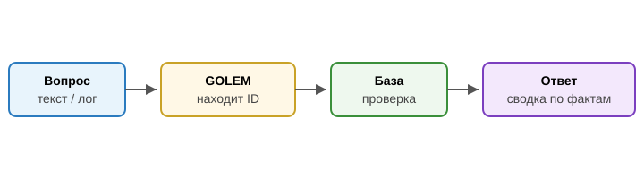
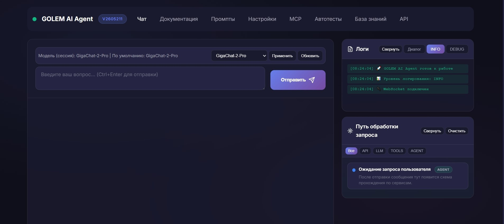
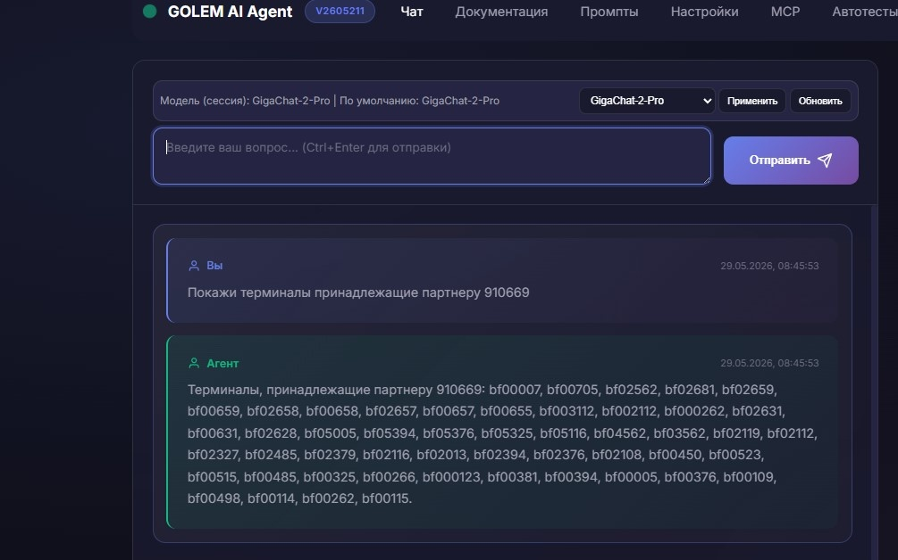

## Проблематика

Со стороны сопровождения часто необходимо получить информацию: **что известно по этому терминалу**, **есть ли такой мерчант в базе**, **к какой точке обслуживания (ТО) привязан терминал**, **были ли операции по терминалу/партнеру (ТСП/ГТСП) за последние дни**.

- Сейчас необходимо открывать базу или запрашивать отчёт в ИАС/ПЦ — на простой ответ уходили **минуты**
- Для получения обобщенной информации требуется вручную сопоставлять все идентификаторы

## Инструменты

- **База операционных данных** — SQL база данных с таблицами терминалов и транзакций (только чтение, без изменений)
- **GigaChat** — понимает формулировку вопроса и собирает понятный ответ по фактам из базы

## Решение

Реализован **MVP** инструмента поиска и обобщения информации по инфраструктуре. 
В рамках MVP агенту доступна локальная "демонстрационная" база данных с инфраструктурой. 
Агента можно **спросить по-человечески** — система **проверит базу** и ответит сводкой.
Агентность заключается в умении автоматически формировать запросы в доступные базы данных. 
Каждый запрос валидируется на уровне системы - разрешены только запросы на чтение.
Это один из "кирпичиков", который можно включить в общий аналитический инструмент

- Понимает терминал, мерчант, ТСП, ГТСП — идентификаторы и наименования
- Два типичных режима: **«есть ли в базе?»** и **«покажи обзор за последние дни»** (по умолчанию три дня)
- Ответ опирается только на то, что реально нашлось в данных.

## Демо

Покажем в чате: пишем «Покажи информацию по терминалу 12345678» — через несколько секунд видим привязку к ТСП, статус и была ли активность за последние дни.

## Вопросы?

?
