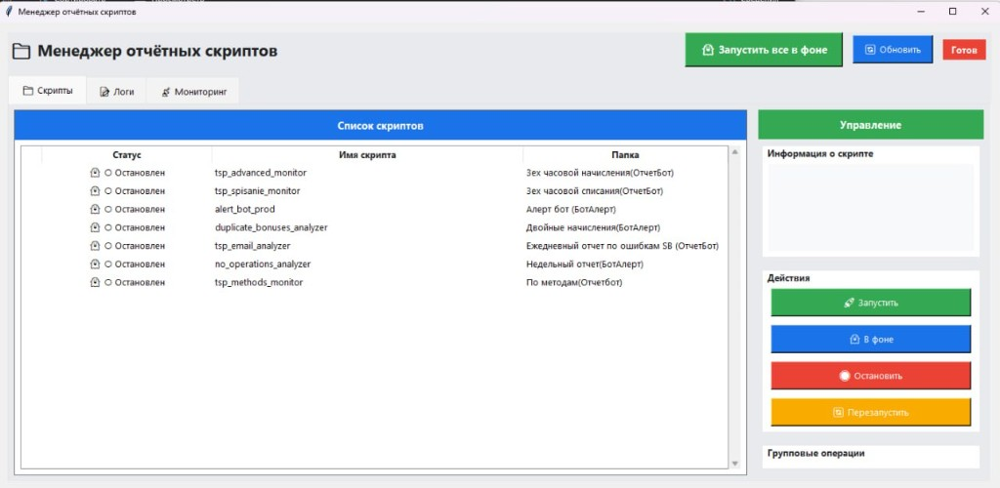
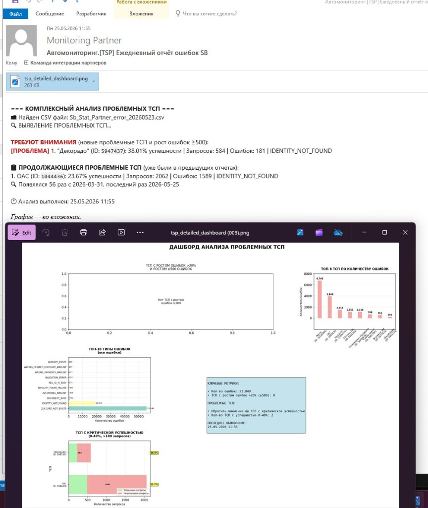
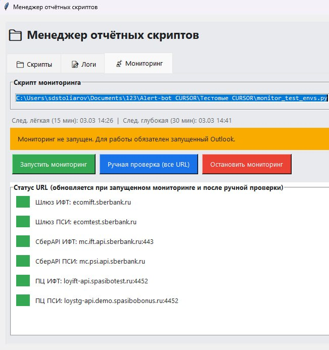
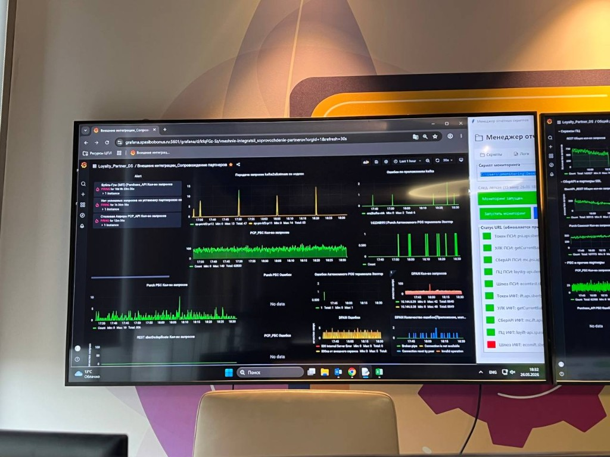

## Проблематика

По партнёрам нужно **следить за разными сигналами**: упали начисления или списания, пришли ошибки интеграции, пропали операции, всплеск по методам. Плюс **тестовые среды** для интеграций — ИФТ, ПСИ, шлюзы — должны быть доступны. Отчёты в **почте и на диске**, статусы URL — отдельно; вручную не успеваешь.

- **Отчеты от ПЦ по ошибкам в разрезе терминалов** — CSV в Outlook; без автоматики легко не заметить рост по партнёру
- **Обороты** — выгрузки каждые несколько часов; «кто просел» видно не сразу
- **Сырые отчёты** — тысячи строк; нужно вытащить только «флаги» и полезные цифры
- **Тестовые стенды** — много URL; падение среды партнёр не увидит, пока не позвонит

## Инструменты

| Инструмент | Зачем |
|------------|-------|
| **Python + Pandas** | Чтение отчётов, метрики и пороги по каждому ТСП |
| **Outlook / DWH** | Почта с CSV и файлы выгрузок на `Z:\` |
| **Telegram и почта** | Алерт дежурному: отклонение по партнёру или по URL стенда |
| **Deepseek** | Сборка скриптов для отслеживания событий по флагам*
| **Cursor** | Формирование единого интерфейса для собрки всех инструментов в единый механизм

## Решение

Реализован **набор инструментов**, который ищет «флаги» в данных, пересчитывает в понятные метрики и решает, алертить или нет.

- **Отчеты от ПЦ по ошибкам, в разрезе терминалов** — ежедневный разбор писем; «проблемные» партнёры и сводка вместо сырого CSV
- **Начисления / списания** — мониторинг ~каждые 3 часа: падение к норме, перекрёстные суммы
- **По методам, двойные бонусы, нет операций** — проверка двойных начислений, отсутвия операций
- **Мониторинг тестовых сред** — Техническая проверка доступности тестовых стендов для партнеров
- **GUI** — список активных скриптов, «запустить все в фоне», логи и мониторинг в одном окне

## Демо

1. **Скрипты** — активные отчётные боты: ищут флаги, считают метрики, готовят алерты
2. **Результат** — не сырой отчёт, а сформатированная сводка: кого смотреть и почему
3. **Тестовые среды** — вкладка «Мониторинг»: статус URL партнёрских стендов
4. **На практике** — как команда использует дашборды и мониторинг в работе

## Вопросы?

?
