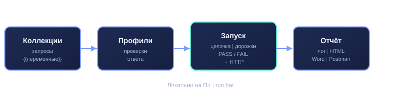
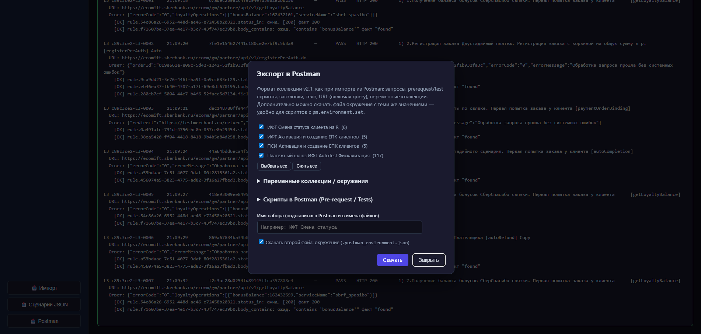
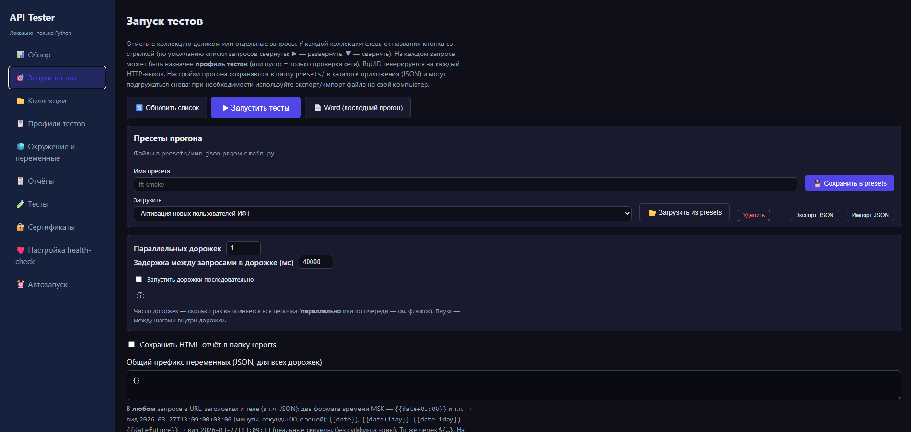

# API Tester

Автоматизация проверки и регресса API

Локально · Python · браузер · run.bat

---

## Проблема

Проверка API и создание отчёта на тестовых стендах часто занимает много времени

- **Регресс тесты** после релиза — долгий ручной прогон
- Форимирование отчёта о тестировании занимает много времени
- Повторяющиеся проверки и поддержка тестовых пользователей с разными переменными

---

## Инструменты

- **Python + браузер** — `run.bat`, без Docker и отдельной БД
- **Импорт Postman** — перенос знакомых коллекций и скриптов
- **Профили проверок** — код, JSON, время ответа; часть Postman Tests подхватывается сама
- **Пресеты и планировщик** — сохранить настройки тестового прогона в файл, запуск по расписанию

---

## Решение

**API Tester** — локальный контур для автоматизации проверки и выполнения регресса API.

- **Единные коллекции и переменные** — получение переменных из ответа — в следующий шаг прогона
- **Запуск тестов** — дорожки с разными переменными, повторы, доп. запросы при ошибке и возможность сохранять и загружать настройки прогонов
- **Отчёты и экспорт** — HTML / Word, выгрузка коллекций обратно в Postman

*Локально на ПК · run.bat*

---

## Коллекции

Привязываем профили тестов к запросам, для выполнения проверок.

---

## Профили и запуск

- **Профили тестов** — правила проверки без правки кода
- **Запуск тестов** — отмечаем цепочку → **«Запустить»** → в логе PASS / FAIL

<video src="01-collections.mp4" controls width="960" poster="01-collections.png"></video>

*Демо: коллекции и прогон запросов*

---

## Отчёты и передача коллегам

- Лог прогона, **HTML / Word**
- **Экспорт в Postman** — коллекция + окружение
- Передать сценарий: папка приложения + `presets/*.json`

<video src="02-run.mp4" controls width="960" poster="02-run.png"></video>

*Демо: запуск и лог*

---

## Вопросы?

- Можно ли передать сценарий коллеге одной папкой или пресетами?
- Что делать, если API изменился?
- Подходит ли для ночных прогонов без участия человека?
