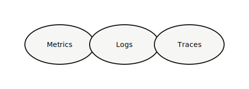

## Проблема

При инциденте **непонятно где искать**: логи в трёх системах, метрик нет на новых эндпоинтах.

## Инструменты

- **Prometheus + Grafana**
- **Loki** — логи
- **OpenTelemetry** — трейсы

## Решение

Стандартный набор дашбордов + **обязательные RED-метрики** для каждого нового API.

## Демо

Дашборд: всплеск 5xx и связанный trace.

## Вопросы?

SLO фиксируем до релиза или после?
