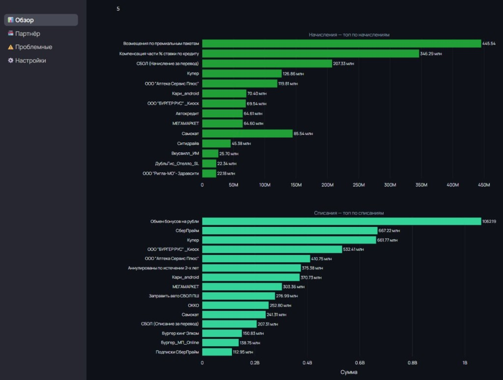
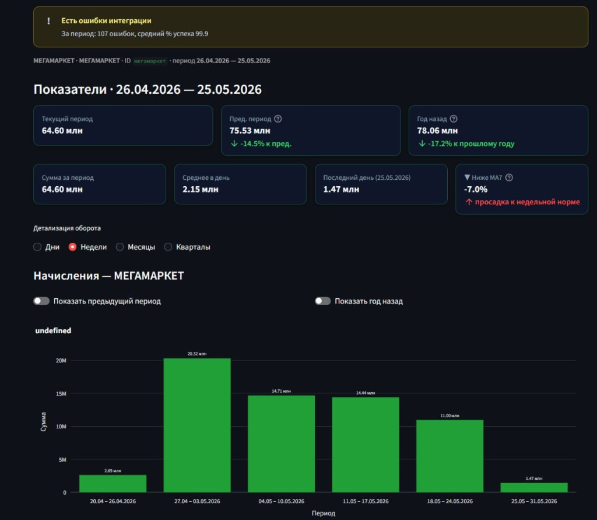
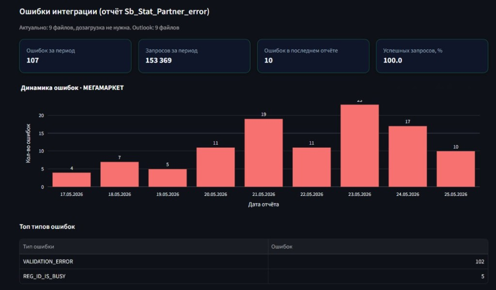
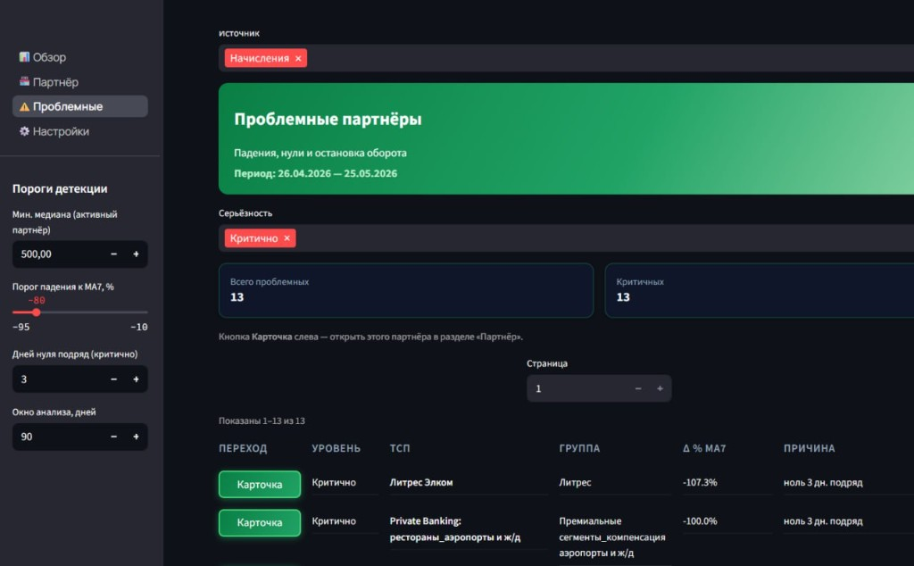

## Проблематика

Разобраться с **конкретным партнёром** по разрозненным отчётам неудобно: нужно собрать картину по цифрам, **проанализировать графики** и отдельно **проверить ошибки** — и только потом что-то сформулировать.

- В случае, если упали обороты **(начисления/списания)** и необходим анализ - приходится собирать данные по оборотам с отчетов на диске Z, приводить их в "Человеческий" вид и интропретировать.
- Каждый раз заново искать файлы, сводить данные и описывать вывод — долго и легко что-то упустить
- Нет одного экрана, где видно и динамику партнёра, и проблемы, и ошибки интеграции

## Инструменты

| Инструмент | Зачем |
|------------|-------|
| **Python** | На нём написан и собран дашборд — локальное веб-приложение на рабочем ПК |
| **Outlook** | Здесь лежат ежедневные отчёты по ошибкам партнёров (CSV из почты) |
| **Диск Z:** | Сетевое хранилище с выгрузками по начислениям и списаниям |
| **Cursor** | На нем собран код + интерфейс. 

## Решение

Сделан **локальный дашборд** — одно окно в браузере с графиками, цифрами и готовыми срезами, без отдельного сервера - локально на ПК. 

Данные можно смотреть **в разрезе начислений и списаний** — переключаясь между ними в одном интерфейсе, без отдельных Excel и папок для каждого типа оборота.

- **Обзор** — KPI, топы и общая картина по начислениям и списаниям за период
- **Партнёр** — карточка ТСП: динамика, сравнения и ошибки интеграции на одном экране
- **Проблемные** — поиск отклонений по настраиваемым критериям (падения, нули и т.д.)
- Уже загруженные файлы **кэшируются** — не нужно каждый раз искать отчёты заново; быстрее реагировать на отклонения

## Демо

1. **Обзор** — общие вводные: KPI и топы по начислениям и списаниям
2. **Партнёр** — на примере **Мегамаркет**: динамика начислений и показатели за период
3. **Партнёр** — **Мегамаркет**: ошибки интеграции, динамика и топ типов
4. **Проблемные** — партнёры с отклонениями по заданным критериям

## Вопросы?

?
