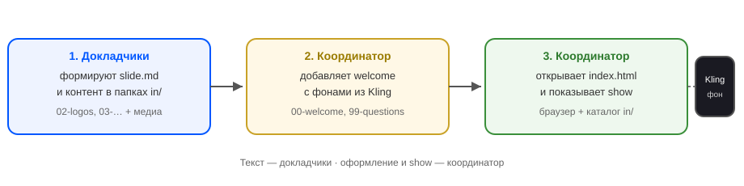
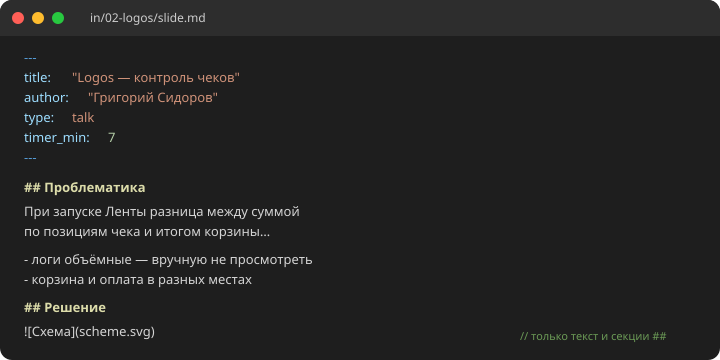
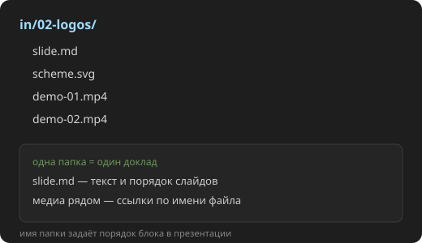
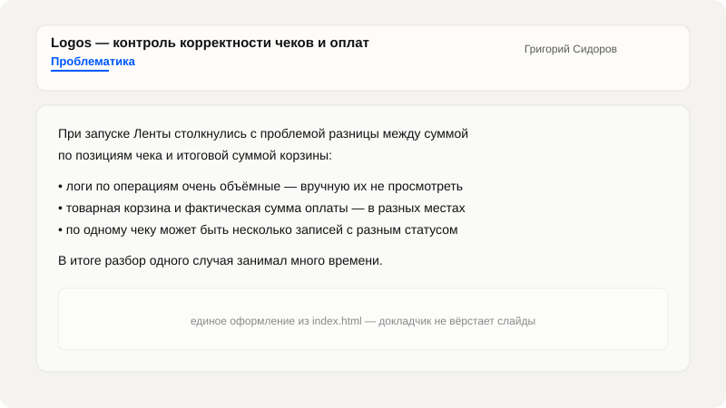

## Проблематика

На митапе несколько докладчиков — у каждого свой PowerPoint или разрозненные материалы. Свести всё в **одну презентацию** вручную долго: править шрифты, переносить картинки, выравнивать тайминг, следить за единым стилем.

- слайды живут в разных файлах и форматах — перед выступлением их нужно «склеивать»
- докладчик отвлекается на вёрстку вместо смысла рассказа
- координатору приходится править дизайн и навигацию отдельно у каждого блока

## Инструменты

| Инструмент | Зачем |
|------------|-------|
| **Cursor** | Сборка `index.html`, дизайн слайдов, прогресс-бар, таймер блока, fullscreen для медиа — всё в одном runtime без отдельного build |
| **Kling** | Генерация фоновых видео для welcome и финальных слайдов — единый «кинематографичный» стиль без монтажа вручную |
| **Markdown** | Каждый проект — одна папка с `slide.md` и медиа; докладчик пишет только текст и структуру секций |

## Решение

**SHOW** — один HTML-файл и каталог `in/`: браузер сам собирает презентацию из папок с `slide.md`. Докладчик фокусируется на **смысле и MD-тексте**, координатор — на **оформлении и фичах** (обратный отсчёт, сегментированный прогресс-бар, переход между блоками).

- папка = блок выступления; порядок папок = порядок в презентации
- секции `##` в MD становятся слайдами; демо — картинки и видео рядом с файлом
- `timer_min` в frontmatter задаёт оранжевый таймер блока; синий прогресс делится на кликабельные сегменты по папкам

## Демо

1. **Пример MD доклада** — frontmatter, секции `##` и ссылки на медиа; без HTML и вёрстки
2. **Структура папки** — `slide.md` и файлы демо в одном каталоге блока
3. **Пример слайда** — как тот же текст выглядит в show после сборки

## Вопросы?

?
