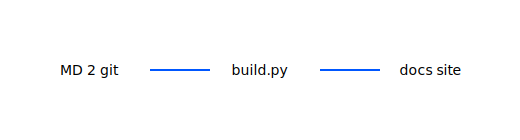

## Проблема

Документация в Notion, Confluence и README — **нет единого поиска** для инженеров.

## Инструменты

- **MkDocs Material**
- **MD из репозиториев**
- **GitHub Pages**

## Решение

Сайт docs из `in/` блоков и ADR: автосборка на push в main.

## Демо

Поиск по ключевому слову и страница runbook.

## Вопросы?

Кто пишет первый черновик — автор сервиса?
