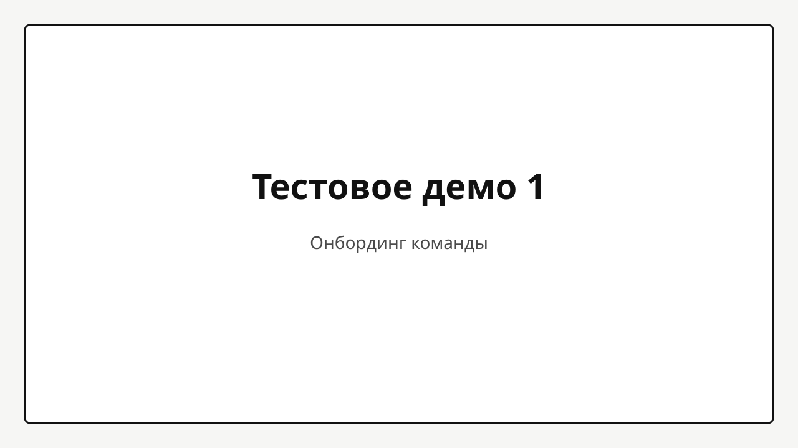
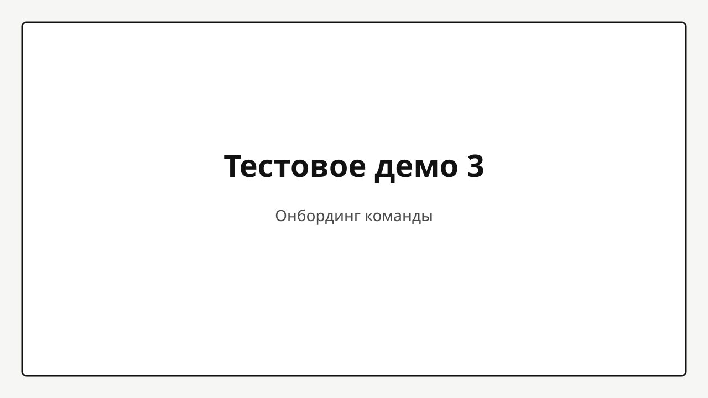

## Проблема

После каждого обновления чат-бота соседние команды **вручную** задавали одни и те же вопросы в интерфейсе — долго, по-разному и без единой «оценки».

- Не было общего чек-листа: что считать нормальным ответом
- Результаты проверки оставались в переписках, а не в одном отчёте
- Сложно сравнить: стало лучше или хуже после смены модели или инструкций

Раньше на такую «санитарную» проверку уходили часы; ошибки замечали уже у пользователей.

## Инструменты

- **Сценарии в Markdown** — файл с вопросами и эталонными ответами (как согласованный «правильный разбор»)
- **Open WebUI** — корпоративный чат, куда уходят вопросы и откуда приходят ответы бота
- **GigaChat** — сравнивает ответ бота с эталоном и выставляет оценку с кратким пояснением
- **Веб-интерфейс** — запуск прогона и отчёт в браузере (для техников — ещё консольная программа)

## Решение

Сделали **автоматическую проверку**: один запуск прогоняет все сценарии и выдаёт **понятный отчёт** — где бот ответил хорошо, где нет и почему.

- Вопрос уходит боту → ответ сравнивается с эталоном → итог в процентах и комментарий
- Можно прогнать **одни и те же вопросы** на разных настройках или моделях и сравнить в одной таблице
- Отчёт можно показать менеджменту и смежникам **без погружения в код**

Технически: репозиторий [agenttester](https://github.com/timptr42/agenttester), развёртывание в Docker, данные и сценарии хранятся на сервере.

## Демо

Покажем: открываем страницу → выбираем сценарий и бота → нажимаем «запуск» → смотрим прогресс → открываем отчёт: вопрос, эталон, ответ бота, оценка и пояснение по каждому пункту.

<video src="demo-02.mp4" controls playsinline preload="metadata"></video>

## Вопросы?

- Нужно ли каждый раз вручную готовить эталонные ответы — кто их согласует?
- Можно ли доверять оценке, если её ставит не человек, а вторая нейросеть?
- Что делать, если бот «умный», но формулировки не совпадают с эталоном дословно?
- Как часто имеет смысл гонять проверку — только перед релизом или регулярно?